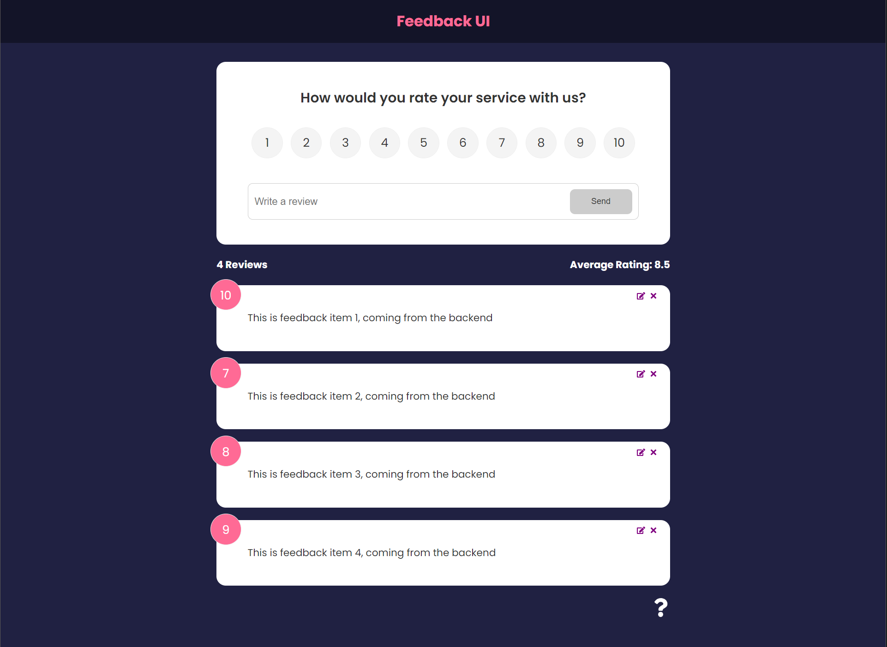

# <h1 align="center">React Feedback App</h1>

<h2 align="center">A React App to leave feedback for a product or service</h2>

## Technologies Used 💻

## Description

A Single Page React App allows users to leave feedback via a number rating system and the ability to leave comments

## Local Development

* Run `npm init -y` from the command line 
* Run `npm i` to install dependencies

## Usage

* Run `npm run dev` from the command line

### Made with ❤️ by  Brad Dunham
